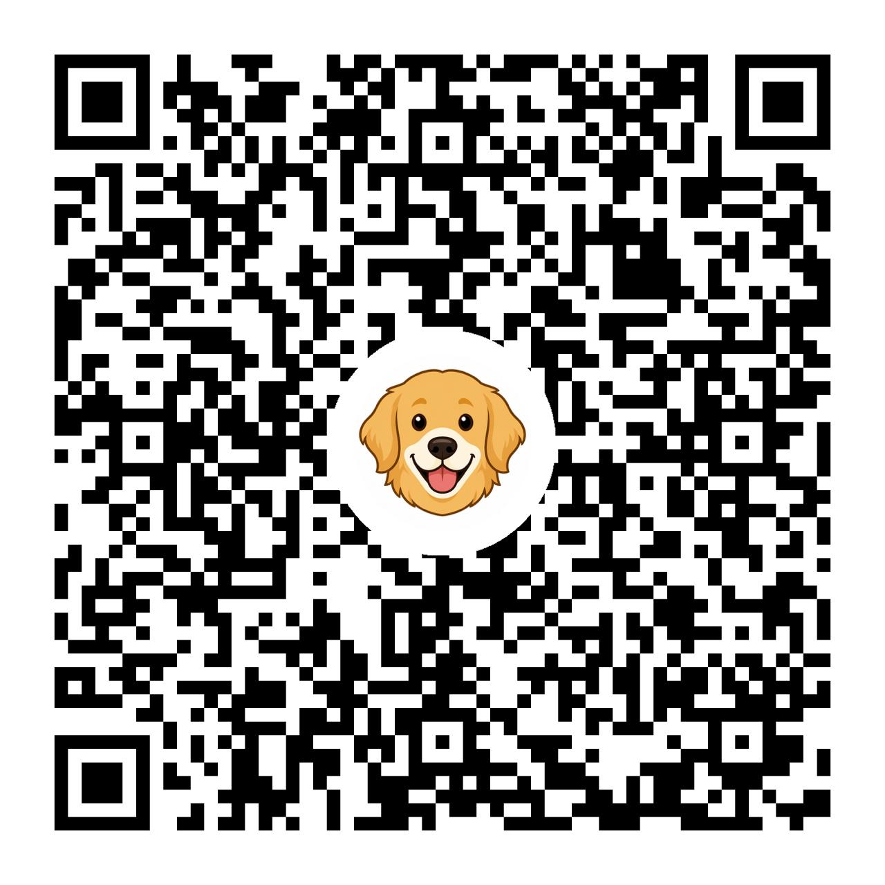

# Century Ethos Pets — how to use the complaint portal

  

This is the user guide for **residents** and **pets volunteers** at Century Ethos. It is not a technical setup document.

**Contact:** [petsofcenturyethos@gmail.com](mailto:petsofcenturyethos@gmail.com)  

---

## Links

| What | Link |
|---|---|
| **Submit a complaint** | [Open the submit page](https://script.google.com/a/%2A/macros/s/AKfycbwr_-DugPvUsWA9plrwVcLxOMVN70BVVHDVoT5oegjiIehwAn0hGkPHOUpb_Gcqo6J0/exec?page=submit) |
| **Public board** (anyone can view) | [Open the ticket list](https://script.google.com/a/%2A/macros/s/AKfycbwr_-DugPvUsWA9plrwVcLxOMVN70BVVHDVoT5oegjiIehwAn0hGkPHOUpb_Gcqo6J0/exec?page=board) |

This QR code will be printed and pasted in lobbies, parks, lifts and common areas for residents to raise complaints and for the Pet team volunteers to work on.

---

## For residents

### Submit a complaint

1. Open the **submit** link (or scan the QR).
2. Sign in with **your Google account**. The first time, Google may show an “unverified app” warning. Choose **Allow** / continue. This only identifies you so volunteers can email you on the same thread.
3. Write a short description of the issue (where, when, what happened).
4. Add **1 to 3 photos**. At least one photo is required.
5. Submit.

You will get an email from **petsofcenturyethos@gmail.com** with a **ticket ID** (for example `ETHOS-PET-20260826-01`). Pets volunteers are copied.

### Follow up

- **Reply on that same email thread.** Do not start a new email. Volunteers and the mailbox stay on the conversation.
- Open **Track this ticket** in the email, or find it on the [public board](https://script.google.com/a/%2A/macros/s/AKfycbwr_-DugPvUsWA9plrwVcLxOMVN70BVVHDVoT5oegjiIehwAn0hGkPHOUpb_Gcqo6J0/exec?page=board).
- When volunteers accept, reject, or resolve the ticket, you get another email on the **same thread**, including their note.

### What you can see without signing in

On the board and on a ticket page, anyone with the link can see:

- Status, dates, SLA flags
- Description and photos
- The latest volunteer note (if any)

**Your name and email are hidden** from the public board and ticket page. Volunteers who are signed in can see them so they can work the complaint.

### Statuses

| Status | Meaning |
|---|---|
| **Open** | Submitted, not yet accepted by a volunteer |
| **In Progress** | A volunteer has accepted it and is working on it |
| **Rejected** | Closed without the requested action — the note / email explains why |
| **Resolved** | Closed after the volunteers treated it as done |

Open + In Progress appear together on the board under the **Open** tab.

### Broken links

If a ticket was removed or the link is wrong, you will see a **Page not found** screen with a button back to the board. Double-check the ticket ID in your email.

---

## For pets volunteers

You must use a Gmail address that is on the society volunteer list. If you cannot sign in, ask the mailbox owner to add you.
Volunteers will be rotated on a monthly basis on the 1st of every month.

### Sign in

1. Open the [public board](https://script.google.com/a/%2A/macros/s/AKfycbwr_-DugPvUsWA9plrwVcLxOMVN70BVVHDVoT5oegjiIehwAn0hGkPHOUpb_Gcqo6J0/exec?page=board) or the ticket link from the complaint email.
2. Tap **Volunteer sign-in**.
3. Choose **your volunteer Gmail**. First time: Google may show “unverified app” → **Allow**.
4. You should see a green bar: **Volunteer view** with your name. Complainant names and emails become visible, and **Accept / Reject / Resolve** appear on open tickets.

Sign-in lasts about **24 hours** in this browser. After that, sign in again.

### The board

Three tabs, newest tickets first, 10 per page:

| Tab | What is in it |
|---|---|
| **Open** | Submitted (**Open**) and accepted (**In Progress**) — this is the work queue |
| **Rejected** | Closed as rejected |
| **Resolved** | Closed as resolved |

Use **Refresh** if a ticket was just queued and has not moved yet (updates usually land within a minute).

### Accept, reject, or resolve

On an **Open** or **In Progress** ticket (list card or ticket page):

1. Tap **Accept**, **Reject**, or **Resolve**.
2. A note box opens:
   - **Accept** and **Resolve** start with a short template. You may edit it.
   - **Reject** starts blank. You must explain why.
3. Tap **Confirm …** (or **Cancel** to go back).
4. The buttons grey out and you should see **Queued — will update shortly.** Wait for **Refresh** or open the ticket again in a minute.

A note is **required** for all three. The system appends your name and email as a signature on Accept and Resolve so the resident can see who acted.

After **Rejected** or **Resolved**, the ticket moves to that tab and the action buttons go away.

### Email

- Every new complaint emails the resident and **CCs volunteers**.
- Work the issue on **that Gmail thread**. Keep people in CC.
- Status changes send another email on the same thread, with your note.
- A **first human reply** on the thread (not the automatic status mail) is what counts toward the “first response” SLA.

### Daily digest

Around **08:30 IST**, listed volunteers/digest addresses get a summary of tickets that are not yet Resolved, plus SLA breach counts. Use it as a morning checklist; still change status **in the app**, not by forwarding the digest.

### SLAs (clock hours, IST)

Starting defaults (the mailbox owner can change these):

- **First human reply:** 4 hours  
- **Resolved or Rejected:** 24 hours  

The board shows **OK** or **Breach** on each card.

### What not to do

- Do not paste volunteer sign-in links into WhatsApp group chats if you are already signed in — those links can include a session. Prefer the public board URL, then sign in on your own phone.
- Do not start a new Gmail thread for an existing ticket.
- Rejected and resolved tickets cannot be reopened in the app. If something was closed by mistake, start a **new** complaint or ask the mailbox owner.

---

## Privacy (short)

| | Public (not signed in as volunteer) | Signed-in volunteer |
|---|---|---|
| Description, photos, status, notes | Visible | Visible |
| Resident name and email | Hidden | Visible |
| Accept / Reject / Resolve | Hidden | Visible on open tickets |

Photos are stored in the society Google Drive and are viewable by anyone who has the photo link (same as opening them from the ticket page).

---

## Help

- **Residents:** reply on your ticket email, or write to [petsofcenturyethos@gmail.com](mailto:petsofcenturyethos@gmail.com).
- **Volunteers:** same mailbox. If sign-in says you are not on the volunteer list, your Gmail is missing from Config.
- **Page not found:** the ticket id is wrong or the ticket was removed. Use [the board](https://script.google.com/a/%2A/macros/s/AKfycbwr_-DugPvUsWA9plrwVcLxOMVN70BVVHDVoT5oegjiIehwAn0hGkPHOUpb_Gcqo6J0/exec?page=board).
